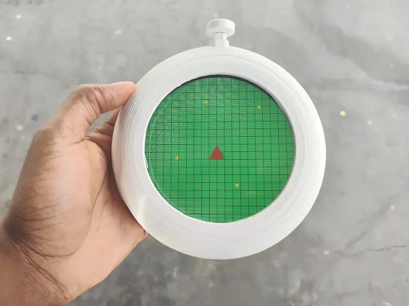
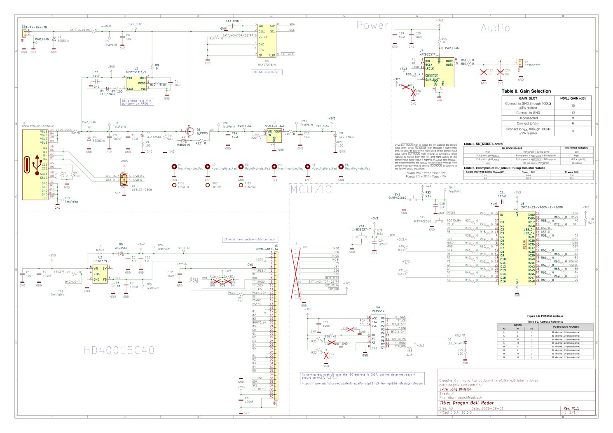

# Dragon Ball Radar

|                                        |                                                              |
|:--------------------------------------:|:------------------------------------------------------------:|
|  |  |

The radar from [Akira Toriyama's *Dragon Ball* series](https://en.wikipedia.org/wiki/Dragon_Ball "Dragon Ball") is now more realistic than ever! This repository contains everything needed to reproduce the project.

For step-by-step directions on how to build the Dragon Radar, please go to [extralongdivision.com/projects/dbz-radar/dbz-radar-tutorial/.](http://extralongdivision.com/projects/dbz-radar/dbz-radar-tutorial/?utm_source=codeberg&utm_medium=organic_social&utm_content=dbz-radar)

For in-depth rationale of the design decisions, please read the [latest development log.](http://extralongdivision.com/projects/dbz-radar/dbz-radar-devlog-2/?utm_source=codeberg&utm_medium=organic_social&utm_content=dbz-radar)

## Project Overview

### License

Everything in this repository is free as in freedom. You can reuse, remix, and reproduce any and all parts of this project as defined by the following:

- Source code is Apache-2.0 licensed

- Documentation and media is Creative Commons Share Alike Attribution 4.0 International

- Hardware is distributed Solderpad Hardware License 2.1

### Capabilities

Pressing and holding the button will turn the radar on and off. Once on, a speaker will beep periodically and the screen will display the a static green grid like in the series. Currently, there are no corresponding dragon balls that the radar detects nor does the screen have any animations.

### Hardware

The mechanical parts were designed for 3D printing. You can find them in the `mcad` directory.

Board manufacturing files are available in `ecad/dbz-radar/production/V1-1/`. You can also generate your own files from the provided KiCAD project. Below is the schematic for the board for convenience.

### Software

The provided source code is written in CircuitPython. The microcontroller is an ESP32-S3, so can you use any other compatible tool-chain to replace or change the firmware.

## Directory Structure

Find the files you need using the descriptions below.

`bin` binaries needed to program the board

`datasheets`for components

`ecad` electronic design project files

`examples` code to ensure hardware works as expected

`graphics-projects` project files used for images displayed on the radar's screen

`LICENSES` for the components of this project

`mcad` mechanical design files for 3D printing or modification

`media`photos used in this README

`src` source code to be copied to the `CIRCUITPY` drive that make the hardware function like a Dragon Radar
